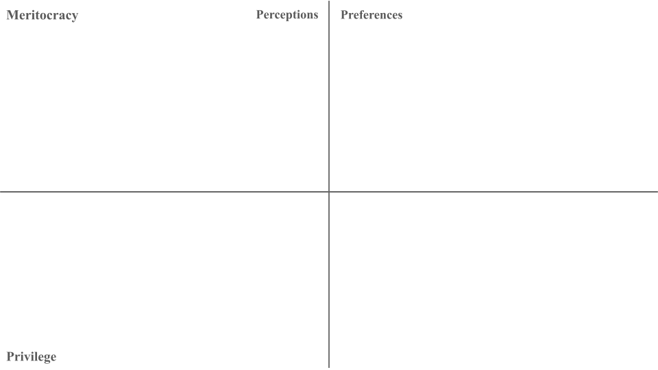
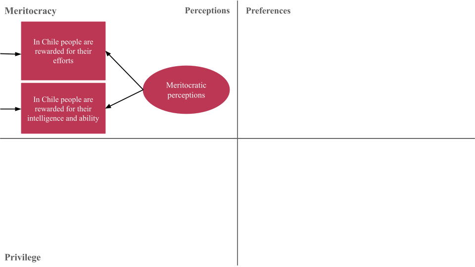
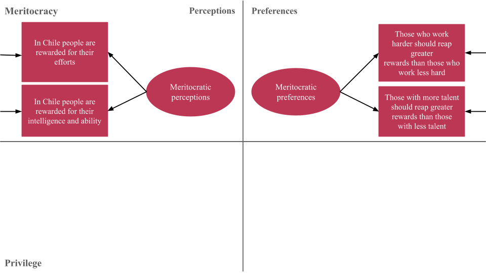
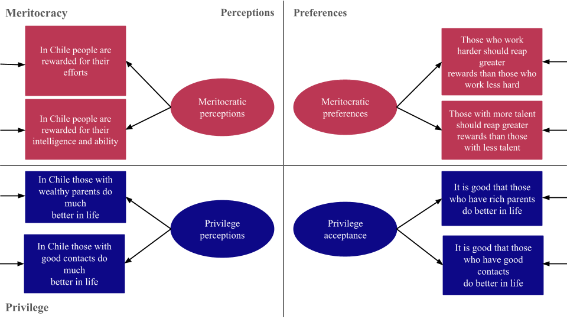
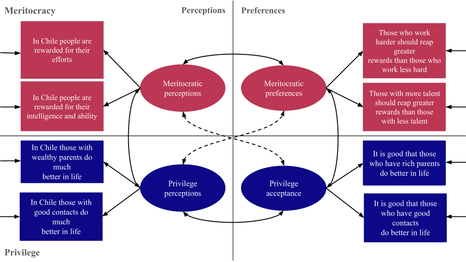
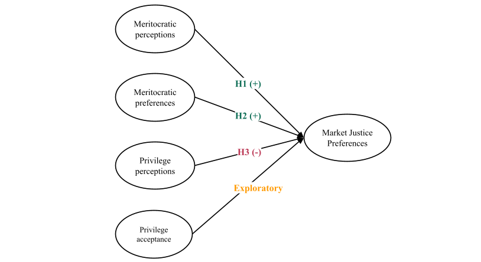

# Context and motivation {background-color="#491106ff"}

## Background

::: {.box-inv-4 .sp-after .fragment style="font-size: 110%;"}

1) Privatization and marketization of public goods, welfare policies, and social services [@gingrich_making_2011; @streeck_how_2016]

:::

::: {.box-inv-4 .sp-after .fragment style="font-size: 110%;"}

2) Changes in the institutional architecture of the welfare state; expansion of market logics [@ferre_welfare_2023; @busemeyer_welfare_2020]

:::

::: {.box-inv-4 .sp-after .fragment style="font-size: 110%;"}

3) This economic order is reflected in a specific moral economy and policy feedback dynamics [@mau_inequality_2015; @campbell_institutional_2020; @fernandez_positive_2013]

:::

::: {.box-inv-5 .sp-after-half .fragment style="font-size: 110%;"}

Market justice preferences [@busemeyer_skills_2015; @castillo_perceptions_2025; @koos_moral_2019; @lindh_public_2015]

:::


::: {.notes}
Since the 1980s, many welfare states have rolled back universal provision and moved toward privatization and commodification of public goods and social services. 

These reforms expanded the role of private actors and pushed market logic into domains previously governed by the state, such as health, education, pensions, and care. 

This not only reassigns risk from the collective to the individual but also reshapes the moral basis of what counts as fair in welfare access, in line with policy feedback literature. Public opinion literature has usually focused on redistributive preferences to study the link between institutional contexts and citizens' beliefs about the state's role in providing public goods. 

More recently, some studies have examined support for the provision of public services based on individual payment capacity, under the label of market-justice preferences. In this study, we focus on market justice preferences and their relationships with meritocracy beliefs.
:::


## Research question and argument {background-color="#491106ff"}

::: {.fragment style="font-size: 130%;"}

**RQ**: _How do perceptions and preferences of meritocracy and privilege shape support for market-based welfare in Chile?_


:::

::: {.fragment style="font-size: 130%;"}

**Argument**: Commodification shifts welfare access from a distributive to a contributory logic, and meritocratic beliefs capture that shift, driving market justice preferences [@castillo_perceptions_2025; @castillo_justification_2026]. We examine their multiple faces.

:::


::: {.notes}
So our research question is: how do perceptions and preferences regarding meritocracy and privilege shape support for market-based welfare in Chile?

The argument runs as follows. Commodification moves the logic of welfare access from a distributive principle to a contributory one, based on ability to pay. Meritocratic beliefs matter precisely because they capture that shift, which makes them a key driver of market justice preferences. With this team, we've shown consistently in Chile that perceiving society as rewarding effort and ability goes hand in hand with support for market-based welfare. Here we push further: a multidimensional lens on how the different faces of meritocracy shape these preferences.


:::

## Multidimensional framework of meritocracy

::: {.fragment}

```{r}
#| fig-cap: "Castillo et al. (2023) measurement model"
#| fig-align: center
#| out-width: '100%'
#| fig-cap-location: bottom
library(knitr)
library(here)



```

:::

::: {.notes}

To capture these different faces of meritocracy, we use a multidimensional framework that expands the usual way meritocracy is measured in empirical research.

:::

## Multidimensional framework of meritocracy


```{r}
#| fig-cap-location: bottom
#| fig-cap: "Castillo et al. (2023) measurement model"
#| fig-align: center
#| out-width: '100%'




```

::: {.notes}

Most studies focus only on meritocratic perceptions, that is, whether people believe that effort and ability are actually rewarded in society. This is represented in the upper-left corner of the diagram. 

:::

## Multidimensional framework of meritocracy


```{r}
#| fig-cap-location: bottom
#| fig-cap: "Castillo et al. (2023) measurement model"
#| fig-align: center
#| out-width: '100%'



```

::: {.notes}

What this model adds is, first, a distinction between perceptions and preferences, where perceptions refer to how people think society works and preferences refer to how they think it should work. This is represented in the upper-right corner using the same items, but with a normative sense. 

:::

## Multidimensional framework of meritocracy


```{r}
#| fig-cap-location: bottom
#| fig-cap: "Castillo et al. (2023) measurement model"
#| fig-align: center
#| out-width: '100%'



```


::: {.notes}

Second, it also incorporates non-meritocratic elements, captured through items on family wealth and social connections, both of which are shown at the bottom of the diagram. We call this dimension privilege.

:::

## Multidimensional framework of meritocracy


```{r}
#| fig-cap-location: bottom
#| fig-cap: "Castillo et al. (2023) measurement model"
#| fig-align: center
#| out-width: '100%'



```

::: {.notes}
So, in total, the scale distinguishes four dimensions: perceived meritocracy, perceived privilege, preference for meritocracy, and acceptance of privilege. This means that recognizing privilege is not incompatible with supporting merit. Both can coexist within the same belief system regarding perceptions and preferences.

Also, you can see the two items for each factor, all measured on a four-point agreement scale.

:::


## Hypotheses

:::: {.fragment}


```{r}
#| label: fig-hipo
#| fig-align: center
#| out-width: '100%'
#| echo: false
#| fig-asp: 0.6
#| fig-cap-location: bottom
#| fig-cap: "Hypothesis"




```

:::: 

::: {.notes}

This leads to four hypotheses. 

We hypothesize that higher meritocratic perception relates positively to market justice; higher meritocratic preference, also positively; and higher privilege perception, negatively. The fourth — acceptance of privilege — we treat as exploratory, with no precedent in the field.

:::