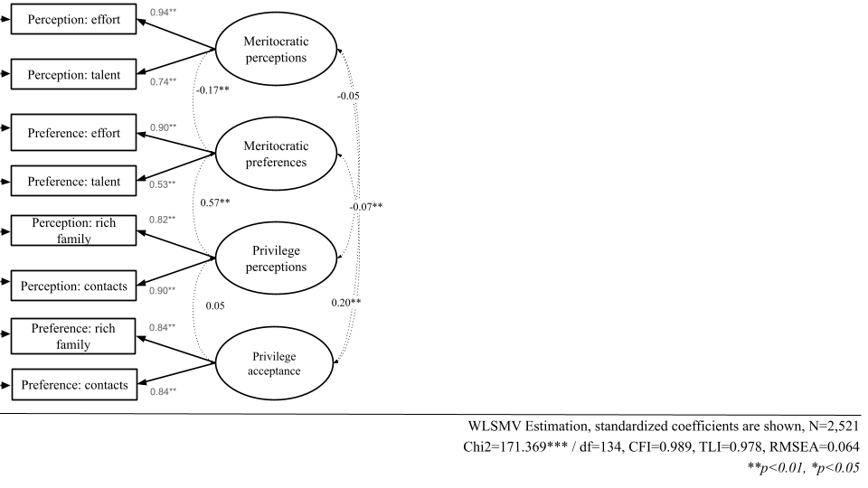
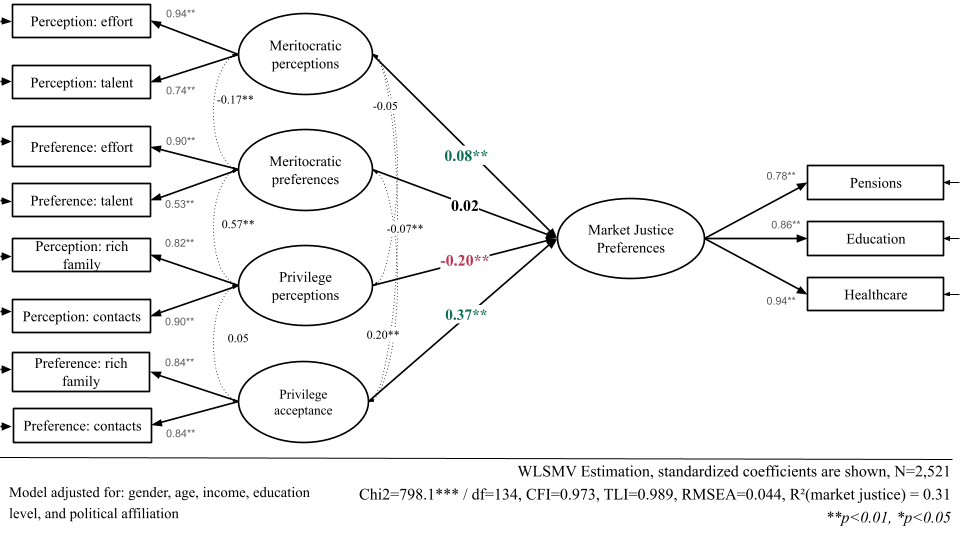

# Results {background-color="#491106ff"}

## CFA

```{r}
#| label: fig-cfa
#| fig-align: center
#| out-width: '100%'
#| echo: false
#| fig-asp: 0.6
#| fig-cap-location: bottom
#| fig-cap: "Confirmatory factor analysis"




```

::: {.notes}

Now to the analysis. We proceed in two steps.

First, we estimate a confirmatory factor analysis of the multidimensional scale, which shows a good fit to the data, as reflected in the fit indices, the high factor loadings, and the significant relations among dimensions. This provides evidence for the scale's latent structure.

Second, we estimate a structural equation model, regressing market justice on the latent meritocracy factors. This is where the multidimensional approach shows its value: by modeling each dimension as a latent factor, the model separates true variance from measurement error and estimates the four structural paths to market justice simultaneously, recovering associations that a summative index would attenuate or obscure. Market justice itself is modeled as a latent factor from three items on fair income-based access to education, health, and pensions.

:::


## SEM Model

```{r}
#| label: fig-sem
#| fig-align: center
#| out-width: '100%'
#| echo: false
#| fig-asp: 0.6
#| fig-cap-location: bottom
#| fig-cap: "Structural equation model"




```

::: {.notes}

Now to the results. 

Perceiving society as meritocratic is associated with greater support for market justice. This is consistent with previous work and an important replication.

But once we treat meritocratic beliefs as multidimensional, new findings appear.

We haven’t found an effect of preferences for meritocracy, perhaps because this factor varies little, as most people normatively support meritocratic principles.

Perceiving privilege relates to lower support. A possible interpretation is that seeing society as driven by privilege rather than merit may heighten awareness of inequality and weaken its justification.

Finally, the most striking result, in our view, is that accepting privilege relates to higher support for market justice, the largest effect in the model. Those who see privilege as a legitimate basis for getting ahead are also the most willing to accept that income should buy better welfare. It is a novel finding, and one we look forward to discussing.

:::