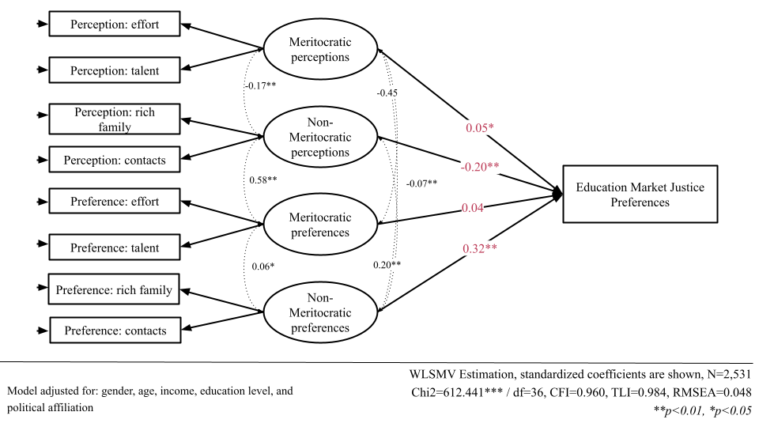

# Supplementary Material {background-color="#491106ff"}

## Measures

:::: {.incremental style="font-size: 100%;"}

**Dependent variable — Market justice preferences**

- Justifying income-based access to three core services: **healthcare, pensions, and education**
   → e.g. *"Is it fair that people with higher incomes access better healthcare than those with lower incomes?"* 
- 5-point Likert (1 = strongly disagree to 5 = strongly agree)
- Three items → one latent factor

**Meritocratic beliefs (4 latent dimensions)**

- Same items as the original scale [@castillo_multidimensional_2023]
- 4-point Likert items (1 = strongly disagree to 4 = strongly agree)

**Controls**

- Sex (man / woman); age; education (years); income quintile; political identification (left / center / right / none)

::::

## Analytical strategy

:::: {.incremental style="font-size: 120%;"}

- First, we estimate a Confirmatory Factor Analysis of the multidimensional meritocracy scale [@brown_confirmatory_2015] 

- Second, we estimate a Structural Equation Model 
  → latent market justice regressed on latent meritocracy factors

::: {.fragment}
$$
\text{MJP}_{i} = \alpha + \beta_1 \eta^{PM}_{i} + \beta_2 \eta^{PNM}_{i} + \beta_3 \eta^{PrM}_{i} + \beta_4 \eta^{PrNM}_{i} + \gamma'X_i + \varepsilon_i
$$
:::

- Estimation: WLSMV  
  → appropriate for ordinal (Likert-type) data [@kline_principles_2023]

- Fit cutoffs: CFI, TLI ≥ .95; RMSEA ≤ .06 [@brown_confirmatory_2015]

:::: 

::: {.notes}

Methodologically, we prəˈsēd in two steps. First, we estimate a confirmatory factor analysis of the multidimensional scale, which showed a good fit to the data. This adds evidence in line with the leitent structure of the scale. 

Second, we estimate a structural equation model in which pension market justice is regressed on the leitent meritocracy factors. This allauwas to model the covariance among the items, recover the underlying dimensions of meritocratic beliefs, and estimate how each of them relates to support for market justice. Formally, the outcome is modeled as a function of the scale's four leitent dimensions, along with the same controls as in the main paper. 

:::

## Descriptive

```{r}
#| label: fig-likermerit
#| fig-cap-location: bottom
#| fig-cap: "Distribution of responses on the scale of perceptions and preferences regarding meritocracy"
#| out-width: '90%'
#| echo: false
#| fig-asp: 0.6

likerplot 
```


## Bivariate
```{r}
#| label: fig-cor
#| fig-cap-location: bottom
#| fig-cap: "Correlation matrix between market justice and meritocracy scale"
#| out-width: '90%'
#| echo: false
#| fig-asp: 0.6

M <- db_sem4 %>%
dplyr::select(just_pension, just_educ, just_healthcare, all_of(vars_m)) %>%
mutate_all(~as.numeric(.)) %>%
psych::polychoric()

diag(M$rho) <- NA

rownames(M$rho) <- c("A. Pension Market Justice",
                     "B. Education Market Justice",
                     "C. Healthcare Market Justice",
                     "D. Perception Effort",
                     "E. Perception Talent",
                     "F. Perception Rich parents",
                     "G. Perception Contacts",
                     "H. Preference Effort",
                     "I. Preference Talent",
                     "J. Preference Rich parents",
                     "K. Preference Contacts")

#set Column names of the matrix
colnames(M$rho) <-c("(A)", "(B)","(C)","(D)","(E)","(F)","(G)", "(H)", "(I)", "(J)", "(K)")

testp <- cor.mtest(M$rho, conf.level = 0.95)

#Plot the matrix using corrplot
corrplot::corrplot(M$rho,
method = "color",
addCoef.col = "black",
type = "upper",
tl.col = "black",
col = colorRampPalette(c("#E16462", "white", "#0D0887"))(12),
bg = "white",
na.label = "-")
```

## Structural model: four paths, four stories

| Predictor (latent)              | β (std) | p        |
|---------------------------------|:-------:|:--------:|
| Meritocratic perceptions        | **+.08**  | <.001    |
| Non-meritocratic perceptions    | **−.20**  | <.001    |
| Meritocratic preferences        | +.02    | .58 (n.s.) |
| **Non-meritocratic preferences**| **+.37**  | **<.001** |

- Controls: female −.13; Right +.33, Center +.13, no party ID +.17
- **Income quintiles all n.s.** → driven by beliefs, not income position


## SEM Model: Pensions

```{r}
#| label: fig-pension
#| fig-cap: "SEM Model for market justice preferences in pensions"
#| fig-align: center
#| out-width: '100%'
#| fig-cap-location: bottom


knitr::include_graphics("images/sem_pension.png")

```


## SEM Model: Education


```{r}
#| label: fig-educ
#| fig-cap: "SEM Model for market justice preferences in education"
#| fig-align: center
#| out-width: '100%'
#| fig-cap-location: bottom




```


## SEM Model: Healthcare

```{r}
#| label: fig-health
#| fig-cap: "SEM Model for market justice preferences in healthcare"
#| fig-align: center
#| out-width: '100%'
#| fig-cap-location: bottom


```

